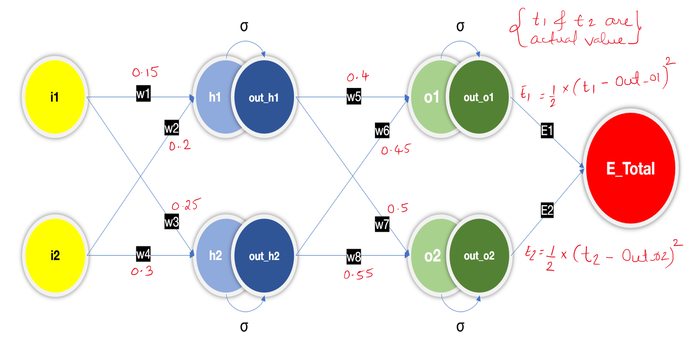
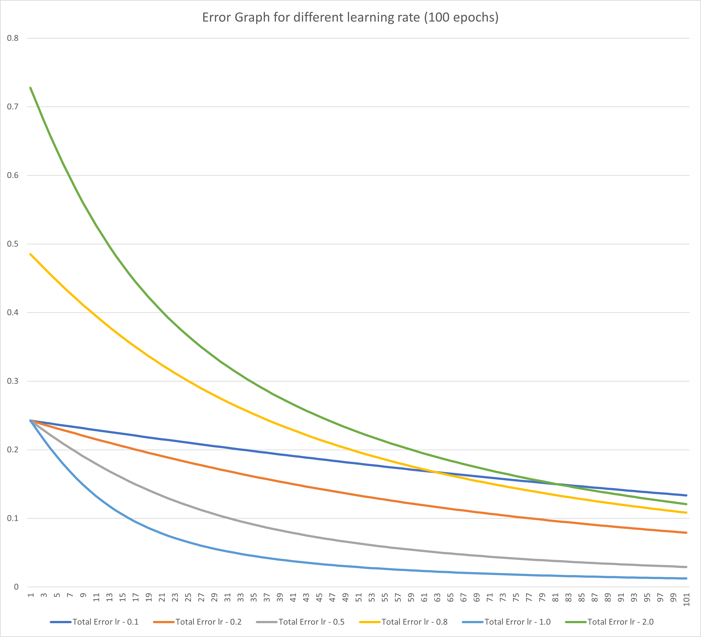

## Part 1 - Backpropagation

Consider a neural network with 1 input, 1 hidden, 1 output layer and arbitrary initialized weights.
The forward pass of the network puts out initial predictions based on the randomly initialized weights of the network.
In a supervised learning settings, the targets/labels are known in prior. These actual labels are then used to correct the models ability to predict with an objective of reducing the difference between the predicted output by network and the actual output. The `Mean Absolute Error (MAE)` or `Mean Squared Error (MSE)` is the loss metric used to evaluate how off the network prediction is relative to the expected output. 
The objective is to reduce the net loss of the network. 

The randomly initialized weights of the network are incrementally nudged based on the loss, such that the model converges over multiple epochs.

For every correct or incorrect predictions (usually in a batch), the idea is to understand the contribution of each of the network parameters in predicting the output. 

Goal is to quantify this contribution
`δ(Error)/δW` where W is {w1, w2, w3, ..., wn} all trainable parameters of the neural network.
Once the gradients/derivatives are calculated with respect to each of the weights of the parameters (Consider this as a matrix operation). We update the weights slightly in the direction (+ve or -ve) that reduces the error by a slight margin.

`This update process is done N times until the local minima is reached and the overall loss of network is reduced.`





#### `h1` and `h2` are the neurons of the hidden layer that recieves the weighted sum of inputs.
```math
$$
\begin{gather*}
h1 = w1 * i1 + w2 * i2 \\
h2 = w3 * i1 + w4 * 12
\end{gather*}
$$
```


#### Activation function - Sigmoid(σ): Introduces non-linearity to the network and makes the gradients differentiable during backprop.
```math
$$
\begin{gather*}
out\_h1 = σ(h1) = 1 / (1 + exp(-h1)) \\
out\_h2 = σ(h2) = 1 / (1 + exp(-h2))
\end{gather*}
$$
```


#### `o1` and `o2` are the output of the network that receives the weighted sum of intermediate layer neurons.
```math
$$
\begin{gather*}
o1 = w5 * out\_h1 + w6 * out\_h2 \\
o2 = w7 * out\_h1 + w8 * out\_h2 \\
out\_o1 = σ(o1) \\
out\_o2 = σ(o2)
\end{gather*}
$$
```


#### Calculate the total error of the network
Get the independent error component from each of the output nodes of the network, the loss function is `Mean Square Error (MSE)`. `1/2` to cancel out the power after derivative.
```math
$$
\begin{gather*}
E1 = 1/2 * (t1 - out\_o1)^2 \\
E2 = 1/2 * (t2 - out\_o2)^2 \\
E\_total = E1 + E2
\end{gather*}
$$
```


#### Calulate the `w5` weights contribution to the total loss (E1 + E2).

-   From the diagram, `w5` doesn't contribute to the `E2` loss. So we drop it, like it's hot!!!
-   But there is not shortcut for the gradients `E2` to reach `w5` from the output node directly. Hence, we need to take into account the `out_o1` and `o1`.

*** How do we do that? Partial derivative - chain rule. ***

```math
$$
\begin{gather*}
δE\_total/δw5 = δ(E1 + E2)/δw5 \\
δE\_total/δw5 = δE1/δw5 \\
δE\_total/δw5 = δE1/δw5 = (δE1 / δout\_o1) * (δout\_o1 / δo1) * (δo1 / δw5)
\end{gather*}
$$
```


Let's calculate these terms `(δE1 / δout_o1) * (δout_o1 / δo1) * (δo1 / δw5)` in order to get the overall contribution of `w5` towards the loss `E_total`.

```math
$$
\begin{gather*}
δE1/δout\_o1 = δ(1/2 * (t1 - out\_o1)^2)/δout\_o1 = (out\_o1 - t1) \\
δout\_o1/δo1 = δ(σ(o1))/δo1 = out\_o1 * (1 - out\_o1) \\
δo1/δw5 = out\_h1
\end{gather*}
$$
```


#### Similar to the way we calculated `δE\_total/δw5`, we calculate the contribution of `w6`, `w7` and `w8` towards the error `E_total`.
```math
$$
\begin{gather*}
δE\_total/δw5 = (out\_o1 - t1) * out\_o1 * (1 - out\_o1) * out\_h1 \\
δE\_total/δw6 = (out\_o1 - t1) * out\_o1 * (1 - out\_o1) * out\_h2 \\
δE\_total/δw7 = (out\_o2 - t2) * out\_o2 * (1 - out\_o2) * out\_h1 \\
δE\_total/δw8 = (out\_o2 - t2) * out\_o2 * (1 - out\_o2) * out\_h2
\end{gather*}
$$
```


#### Apply necessary chain rule to get the intermediate contrinutions.
```math
$$
\begin{gather*}
δE1/δout\_h1 = (out\_o1 - t1) * out\_o1 * (1 - out\_o1) * w5 \\
δE2/δout\_h1 = (out\_o2 - t2) * out\_o2 * (1 - out\_o2) * w7 \\
δE\_total/δout\_h1 = (out\_o1 - t1) * out\_o1 * (1 -out\_o1) * w5 + (out\_o2 - t2) * out\_o2 * (1 - out\_o2) * w7 \\
δE\_total/δout\_h2 = (out\_o1 - t1) * out\_o1 * (1 -out\_o1) * w6 + (out\_o2 - t2) * out\_o2 * (1 - out\_o2) * w8
\end{gather*}
$$
```


#### Calculate the contribution of term `w1`, `w2`, `w3` and `w4` towards the error `E_total` by considering the intermediate hidden layer neurons.
```math
$$
\begin{gather*}
δE\_total/δw1 = δE\_total/δout\_h1 * δout\_h1/δh1 * δh1/δw1 \\
δE\_total/δw2 = δE\_total/δout\_h1 * δout\_h1/δh1 * δh1/δw2 \\
δE\_total/δw3 = δE\_total/δout\_h2 * δout\_h2/δh2 * δh2/δw3 \\
δE\_total/δw4 = δE\_total/δout\_h2 * δout\_h2/δh2 * δh2/δw4
\end{gather*}
$$
```


#### Substitute the values calculated in the above step
```math
$$
δE\_total/δw1 = ((out\_o1 - t1) * out\_o1 * (1 - out\_o1) w5 + (out\_o2 - t2) * out\_o2 * (1 - out\_o2) * w7) * out\_h1 * (1 - out\_h1) * i1 \\
δE\_total/δw2 = ((out\_o1 - t1) * out\_o1 * (1 - out\_o1) w5 + (out\_o2 - t2) * out\_o2 * (1 - out\_o2) * w7) * out\_h1 * (1 - out\_h1) * i2 \\
δE\_total/δw3 = ((out\_o1 - t1) * out\_o1 * (1 - out\_o1) w6 + (out\_o2 - t2) * out\_o2 * (1 - out\_o2) * w8) * out\_h2 * (1 - out\_h2) * i1 \\
δE\_total/δw4 = ((out\_o1 - t1) * out\_o1 * (1 - out\_o1) w6 + (out\_o2 - t2) * out\_o2 * (1 - out\_o2) * w8) * out\_h2 * (1 - out\_h2) * i2
$$
```

Phew!!!


### Effect of different learning rate on the total error convergence (refer excel sheet).



